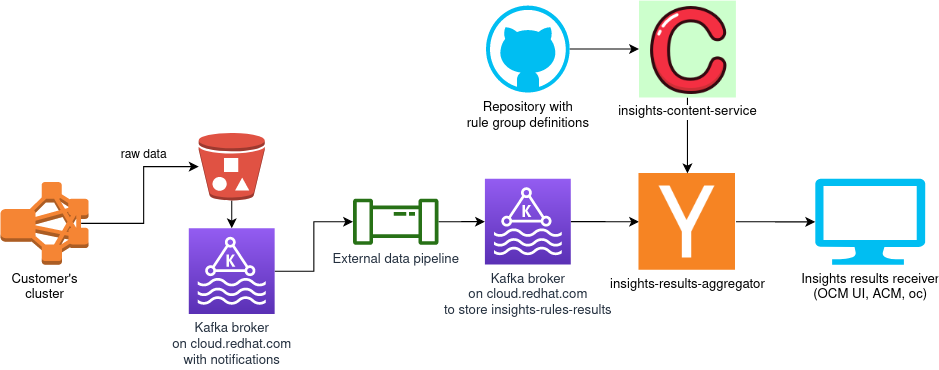

# Insights Content Service

[](https://godoc.org/github.com/RedHatInsights/insights-content-service)
[](https://goreportcard.com/report/github.com/RedHatInsights/insights-content-service)
[](https://travis-ci.org/RedHatInsights/insights-content-service)

Content service for Insights rules groups, tags, and content.

## Description

Insights Content Service is a service that provides metadata information about rules that are being
consumed by Openshift Cluster Manager. That metadata information contains rule title, description,
remmediations, tags and also groups, that will be consumed primarily by
[Insights Results Aggregator](https://github.com/RedHatInsights/insights-results-aggregator).

## Architecture

Content Service consists of three main parts:

1. A rules content parsing that reads the rules metadata from the defined repository, creating data
   structures.
1. A group configuration parser that reads a groups configuration file.
1. HTTP or HTTPS server that exposes REST API endpoints that can be used to read a single rule
   metadata content, a list of groups and a list of tags that belongs to a group.

## Content service in the external data pipeline

The chosen architecture at this point is architecture #2 (docs/architectures), where the insights-content-service will now be called directly from insights-results-aggregator, which will send complete information about the rules in one call, along with the rule groups retrived from content-service.

From the long term perspective, architecture #3 is desirable, where all conent-related processing will be moved from aggregator to content-service.
The proxy/router will route requests accordingly, which is temporarily done by aggregator in architecture #2.



## Documentation for developers

N/A

## Configuration

Content service expects a toml configuration file. Default one is `config.toml` in working directory,
but it can be overwritten by `INSIGHTS_CONTENT_SERVICE_CONFIG_FILE` env var.

Also each key in config can be overwritten by corresponding env var. For example if you have config

```toml
[server]
address = ":8080"
api_prefix = "/api/v1/"
api_spec_file = "openapi.json"
```

and environment variables

```shell
INSIGHTS_CONTENT_SERVICE__SERVER__ADDRESS=":443"
INSIGHTS_CONTENT_SERVICE__SERVER__API_PREFIX="/api/v2/"
```

the actual server port will be 443 and the API base endpoint will be `/api/v2/` instead of `/api/v1/`.

It's very useful for deploying docker containers and keeping some of the configuration outside
the main configuration, like passwords and secret tokens.


## Server configuration

The server configuration is in the section `[server]` in the configuration file.

```toml
[server]
address = ":8080"
api_prefix = "/api/v1/"
api_spec_file = "openapi.json"
```

* `address` is the host and port which server should listen to
* `api_prefix` is the prefix for the REST API path
* `api_spec_file` is the location of a required OpenAPI specification file

## Groups configuration

The groups are defined in a YAML configuration file. You can find an example in
[groups_config.yaml](groups_config.yaml).

In order to define which groups configuration file is loaded by the service, you
should use the `[groups]` section in the configuration file:

```toml
[groups]
path = "groups_config.yaml"
```

Where `path` is the absolute or relative path to the groups configuration file.

## Local setup

TBD

## REST API schema based on OpenAPI 3.0

Content service provides information about its REST API scheme via the endpoint `api/v1/openapi.json`. OpenAPI 3.0
is used to describe the schema; it can be read by human and consumed by computers.

For example, if content service is started locally, it is possible to read schema based on OpenAPI 3.0
specification by using the following command:

```shell
curl localhost:8080/api/v1/openapi.json
```

## Contribution

Please look into document [CONTRIBUTING.md](CONTRIBUTING.md) that contains all information about how to
contribute to this project.

## Testing

tl;dr: `make before_commit` will run most of the checks by magic

The following tests can be run to test your code in `insights-content-service`.
Detailed information about each type of test is included in the corresponding subsection:

1. Unit tests: checks behaviour of all units in source code (methods, functions)

### Unit tests

Set of unit tests checks all units of source code. Additionally the code coverage is computed and displayed.
Code coverage is stored in a file `coverage.out` and can be checked by a script named `check_coverage.sh`.

To run unit tests use the following command:

`make test`

## CI

[Travis CI](https://travis-ci.org/) is configured for this repository. Several tests and checks are started for
all pull requests:

* Unit tests that use the standard tool `go test`.
* `go fmt` tool to check code formatting. That tool is run with `-s` flag to perform
  [following transformations](https://golang.org/cmd/gofmt/#hdr-The_simplify_command)
* `go vet` to report likely mistakes in source code, for example suspicious constructs, such as
  Printf calls whose arguments do not align with the format string.
* `golint` as a linter for all Go sources stored in this repository
* `gocyclo` to report all functions and methods with too high cyclomatic complexity. The cyclomatic
  complexity of a function is calculated according to the following rules: 1 is the base complexity of
  a function +1 for each 'if', 'for', 'case', '&&' or '||' Go Report Card warns on functions with cyclomatic
  complexity > 9
* `goconst` to find repeated strings that could be replaced by a constant
* `gosec` to inspect source code for security problems by scanning the Go AST
* `ineffassign` to detect and print all ineffectual assignments in Go code
* `errcheck` for checking for all unchecked errors in go programs
* `shellcheck` to perform static analysis for all shell scripts used in this repository
* `abcgo` to measure ABC metrics for Go source code and check if the metrics does not exceed specified
  threshold

Please note that all checks mentioned above have to pass for the change to be merged into master branch.

History of checks performed by CI is available at [RedHatInsights / insights-content-service](https://travis-ci.org/RedHatInsights/insights-content-service).
